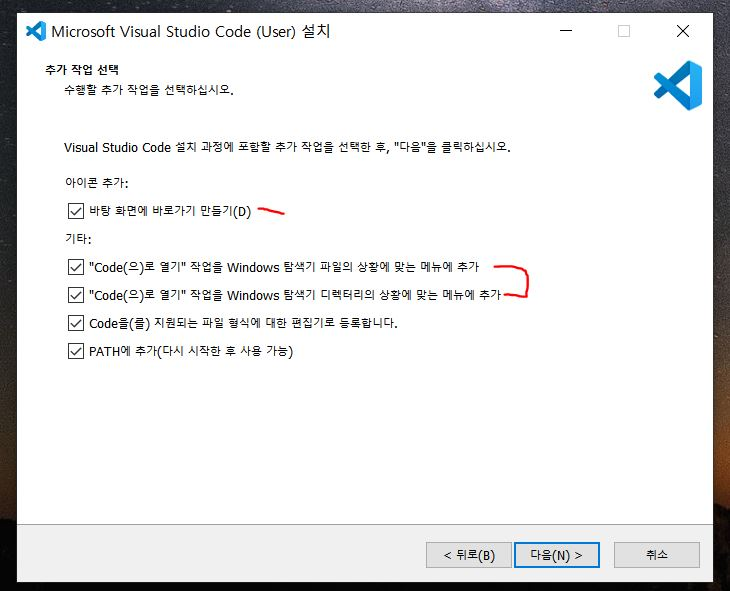

# VSCODE 설치

- 아래 설치 경로 접속

1. https://code.visualstudio.com/download
2. 모두 체크 후 다음 누르면 설치 완료.
   

3. 설치가 완료되면 Extensions를 들어가 필요한 패키지 설치.

- `Extensions` 이란? 플러그인(개발 편의를 위해 기능을 확장해 새로운 기능을 추가하는 역할)
- Material Icon (아이콘)
- Live Server (go live, 실시간 수정 반영)
- Auto Rename (여는or닫는 태크명 변경시 함께 변경됨)
- CSS Peek (css class이름으로 빨리 찾기)
- Auto Close(여는 태그를 입력하면 닫는 태그를 자동으로 추가)
- Prettier(정렬 설정)

4.  Prettier 설정 방법

- .vscode 폴더 생성
- .vscode 폴더에 settings.json 파일 생성
- .prettierrc 파일 생성 후 아래 json 복사 붙여넣기

```json
{
  "singleQuote": true, //''싱글 코드 설정
  "semi": true, //홑따옴표를 쓸건지 설정, 기본값은 쌍따옴표 (default: false)
  "useTabs": false, //세미클론 강제여부 (default: true)
  "tabWidth": 2, //탭너비 들여쓰기, 기본값은 4
  "trailingComma": "all", //객체, 배열, 함수 등의 후행에 쉼표를 찍을지 제어
  "printWidth": 150 //탭 너비 (default: 2)
}
```
